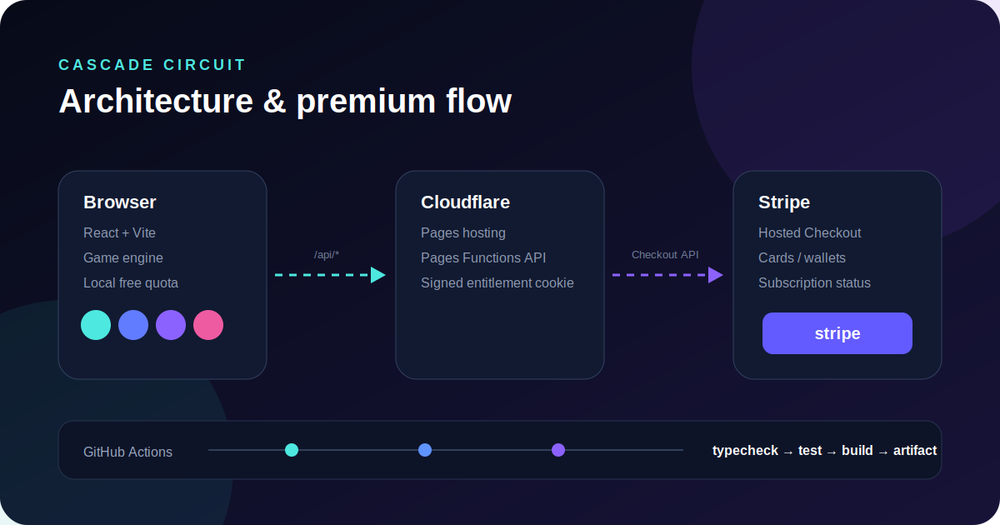
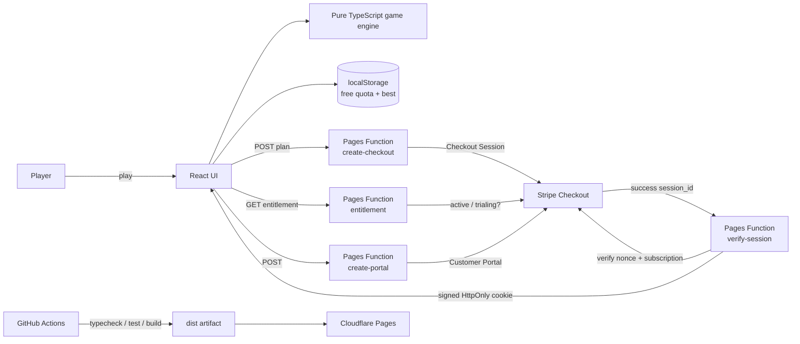

# Cascade Circuit



**落として、つないで、連鎖を起こす。** 6列のボードへエネルギー球を落とし、同じレベルが上下左右に3個以上つながると1段階進化します。落下後の盤面変化でさらに3個以上がつながると連鎖倍率が上がる、1プレイ約3分のオリジナルWebパズルです。

## Live app

- Production: https://cascade-circuit.pages.dev
- GitHub Actions: https://github.com/univcorp2-ctrl/cascade-circuit/actions

> 既存ゲームのコード・名称・画像・音声・問題データはコピーしていません。広く知られた「落下」「同値合成」「日替わり挑戦」という抽象的な遊びの要素を再構成し、3個以上の連結判定、連鎖倍率、36手制、6×8盤面という独自ルールにしています。

## なぜこの企画か

2025〜2026年の簡易調査では、Wordle系の日替わりゲームは「短いルール・毎日の再訪・結果共有」が強く、数字合成パズルは説明コストが低くブラウザ実装も小さくできます。NYTが2025年に数字ロジックのPipsを追加したことも、言語に依存しない短時間パズルの余地を示しています。

- [PC Gamer: Games like Wordle (2026)](https://www.pcgamer.com/best-games-like-wordle/)
- [TechRadar: NYT Pips launch (2025)](https://www.techradar.com/computing/websites-apps/the-nyt-just-launched-a-new-daily-game-but-its-no-wordle)
- [SteamDB: 2048系タイトルのレビュー例](https://steamdb.info/app/942050/charts/)
- [Official 2048 Google Play listing](https://play.google.com/store/apps/details?id=com.gabrielecirulli.app2048)

## 実装済み

- React + TypeScript + ViteのレスポンシブゲームUI
- 6×8ボード、列ドロップ、上下左右の同値3個以上合成、重力、複数連鎖
- 日付シード、36手制、スコア、最大レベル、ベストスコア、Web Share
- 無料枠: ローカル日付ごとに5ラウンド
- Premium: 月額 / 年額のStripe Checkoutサブスクリプション
- Checkout nonce照合、Stripeサブスクリプション状態確認、HMAC署名HttpOnly Cookie
- Stripe Customer Portalによる解約・支払方法変更のセルフサービス導線
- Cloudflare Pages Functionsの `/api/create-checkout`、`/api/verify-session`、`/api/entitlement`、`/api/create-portal`
- プライバシー、利用規約、特商法表記の初期テンプレート
- Vitest、TypeScript型検査、GitHub Actions、devcontainer、Cloudflare Pages

## 収益モデル

無料ユーザーは登録なしで1日5回プレイできます。6回目にPaywallを表示し、月額480円または年額3,800円のPremiumへ誘導します。実際の請求額はStripe Price設定を正としてください。Premiumは無制限プレイ、広告なし、テーマ、将来モードの先行解放を想定しています。

決済はStripeホスト型Checkoutです。カードに加え、利用者の端末・ブラウザ・Stripe設定・地域が対応している場合はApple Pay / Google Pay等がCheckoutに表示されます。購入後はヘッダーの「契約管理」からStripe Customer Portalへ移動できます。

- [Stripe Checkout](https://docs.stripe.com/payments/checkout)
- [Checkout Session API](https://docs.stripe.com/api/checkout/sessions/create)
- [Stripe Customer Portal](https://docs.stripe.com/customer-management)
- [Stripe Apple Pay](https://docs.stripe.com/apple-pay?platform=web)
- [Stripe Google Pay](https://docs.stripe.com/google-pay)

## ローカル起動

```bash
npm install
npm run dev
```

ゲーム本体はSecretsなしで動きます。決済APIを含むローカル確認はCloudflare Pages Functions用の開発環境が必要です。詳細は [`docs/setup.md`](docs/setup.md) を参照してください。

## 品質確認

```bash
npm run lint
npm test
npm run build
```

## アーキテクチャ



設計の詳細は [`docs/architecture.md`](docs/architecture.md) にあります。

## 本番前に必須の設定

Cloudflare Pagesへ以下のSecrets / Variablesを登録します。値はGitHubへコミットしません。

- `STRIPE_SECRET_KEY`
- `STRIPE_MONTHLY_PRICE_ID`
- `STRIPE_YEARLY_PRICE_ID`
- `ENTITLEMENT_SECRET`
- `APP_URL`

また、Stripeで月額・年額のProduct/PriceとCustomer Portalを設定し、特商法表記・利用規約・返金条件・事業者連絡先を実情報へ差し替えてください。

## ディレクトリ

```text
src/game/engine.ts          純粋関数のゲームロジック
src/App.tsx                 UI、無料枠、Premium導線
functions/api/*             Stripe Checkout / entitlement / portal API
public/*.html               法務ページの初期テンプレート
docs/architecture.md        設計と処理フロー
docs/setup.md               Stripe / Cloudflare設定
.github/workflows/ci.yml     CIとdist artifact
.devcontainer/              Codespaces / Dev Container
```

## ライセンス

MIT。ブランド名、デザイン、コンテンツを商用公開する場合は運営者の法務・商標確認を行ってください。
