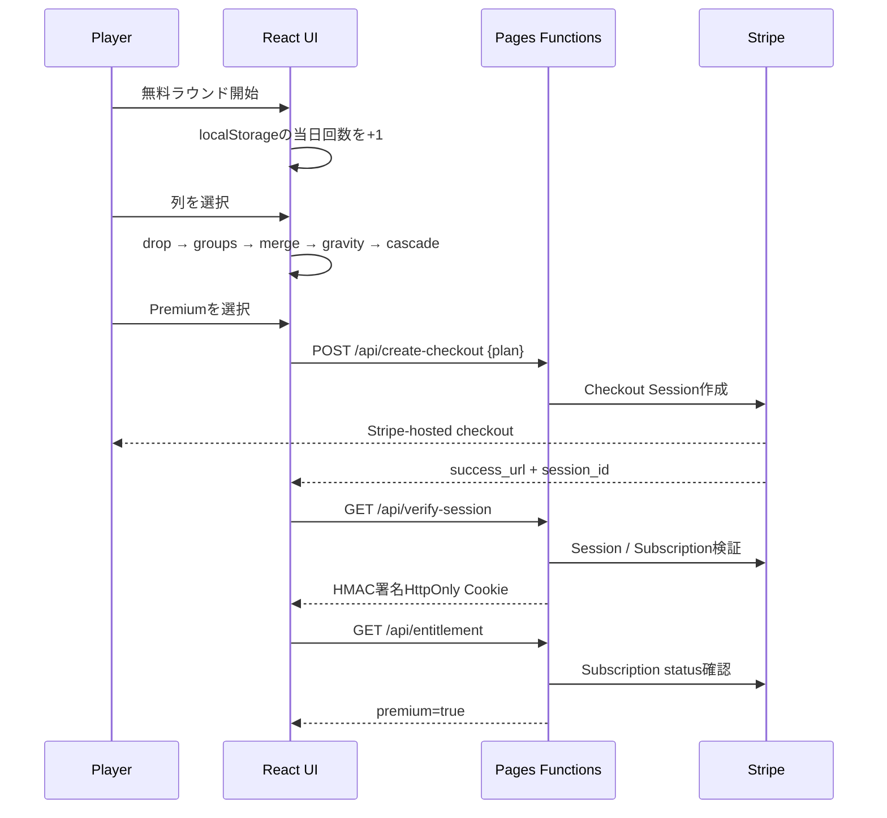

# Architecture

## 全体像

Cascade Circuitは静的ReactフロントエンドとCloudflare Pages Functionsで構成する小さなフルスタックWebゲームです。ゲームロジックはDOMやAPIから分離した純粋TypeScript関数で、盤面コピー、ドロップ、連結成分探索、同時合成、重力、連鎖を決定論的に処理します。

## ゲームエンジン

盤面は `number | null` の二次元配列です。1手ごとに次を実行します。

1. 指定列の最下部の空きセルへ球を配置
2. BFSで同値の上下左右連結成分を列挙
3. 3セル以上の成分を同時に1段階アップ
4. 各列へ重力を適用
5. 新たな3セル以上があれば連鎖として2へ戻る
6. 連鎖数をスコア倍率へ反映

同値2個の衝突ではなく、3個以上の連結成分を対象にする点と、複数成分の同時処理、36手制が主要な独自要素です。

## 無料枠

日付・使用回数をlocalStorageへ保存します。これは導入摩擦を最小化するMVP向けであり、端末変更やストレージ削除をまたぐ厳密な制限ではありません。厳密な制限が必要になった場合はCloudflare Turnstile + D1/KV +匿名デバイストークン、またはユーザー認証へ移行します。

## 決済と権限

`create-checkout` はランダムnonceをHttpOnly Cookieへ保存し、Stripe Checkout Sessionの `client_reference_id` にも設定します。戻り先の `verify-session` はsession ID、nonce、完了状態、subscription IDを検証し、24時間有効のHMAC署名entitlement Cookieを発行します。

`entitlement` はCookie署名・期限を検証したうえでStripe Subscription APIへ問い合わせ、`active` または `trialing` の場合だけPremiumを返します。解約・未払い状態をフロントエンドだけで偽装できません。

## Secrets

- `STRIPE_SECRET_KEY`: Stripe APIのサーバー専用キー
- `STRIPE_MONTHLY_PRICE_ID`: 月額Price ID
- `STRIPE_YEARLY_PRICE_ID`: 年額Price ID
- `ENTITLEMENT_SECRET`: Cookie署名用の十分に長いランダム値
- `APP_URL`: 本番URL

SecretsはCloudflareにだけ置き、GitHubやフロントエンドへ露出させません。

## CI/CD

GitHub Actionsはpush、pull request、手動実行でTypeScript型検査、Vitest、Vite buildを行い、`dist` をartifactとして保存します。main更新はCloudflare PagesのGit連携で本番へ反映します。

## 将来拡張

- Stripe Customer PortalとWebhookによる解約・請求イベント処理
- Cloudflare D1へアカウント、クロスデバイス統計、ランキングを保存
- Turnstileとレート制限
- 盤面テーマ、デイリーパズル、週間リーグ
- Web Audio APIによる効果音
- 管理画面で価格表示・ミッション・A/Bテストを変更
